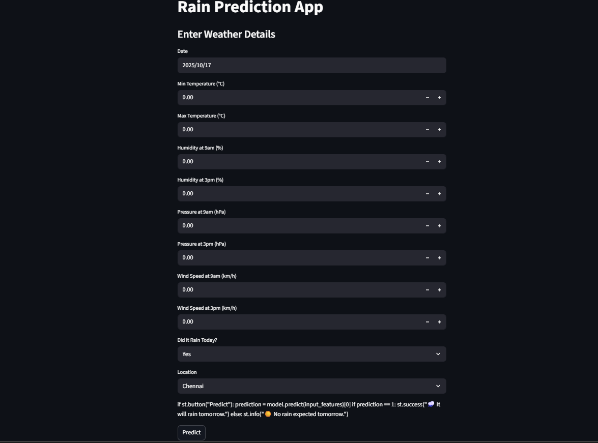

# 🌧️ Rain Prediction using Machine Learning


A comprehensive machine learning project that predicts rainfall probability using multiple algorithms and features an interactive web application.

## 📋 Project Overview

This project demonstrates end-to-end machine learning capabilities by building a rainfall prediction system. It compares multiple ML algorithms and includes a deployable web application for real-time predictions.

### 🎯 Key Features
- **Multiple ML Models**: Random Forest, XGBoost, KNN, Naive Bayes
- **AutoML Integration**: PyCaret for automated model selection
- **Interactive Web App**: Streamlit-based user interface
- **Comprehensive EDA**: Detailed data analysis and visualization
- **Model Explainability**: Feature importance and probability scores

## 🏗️ Architecture

## 📊 Dataset

The dataset contains historical weather data with the following features:

| Feature | Description | Type |
|---------|-------------|------|
| Date | Recording date | Temporal |
| Location | City name (Mumbai, Delhi, etc.) | Categorical |
| MinTemp/MaxTemp | Temperature extremes | Numerical |
| Humidity9am/3pm | Humidity levels | Numerical |
| Pressure9am/3pm | Atmospheric pressure | Numerical |
| WindSpeed9am/3pm | Wind speed measurements | Numerical |
| RainToday | Whether it rained today | Binary |
| RainTomorrow | Target variable | Binary |

## MAIN INTERFACE



## 🛠️ Installation

### Prerequisites
- Python 3.7+
- pip package manager

### Clone the Repository
```bash
git clone https://github.com/yourusername/rain-prediction-ml.git
cd rain-prediction-ml